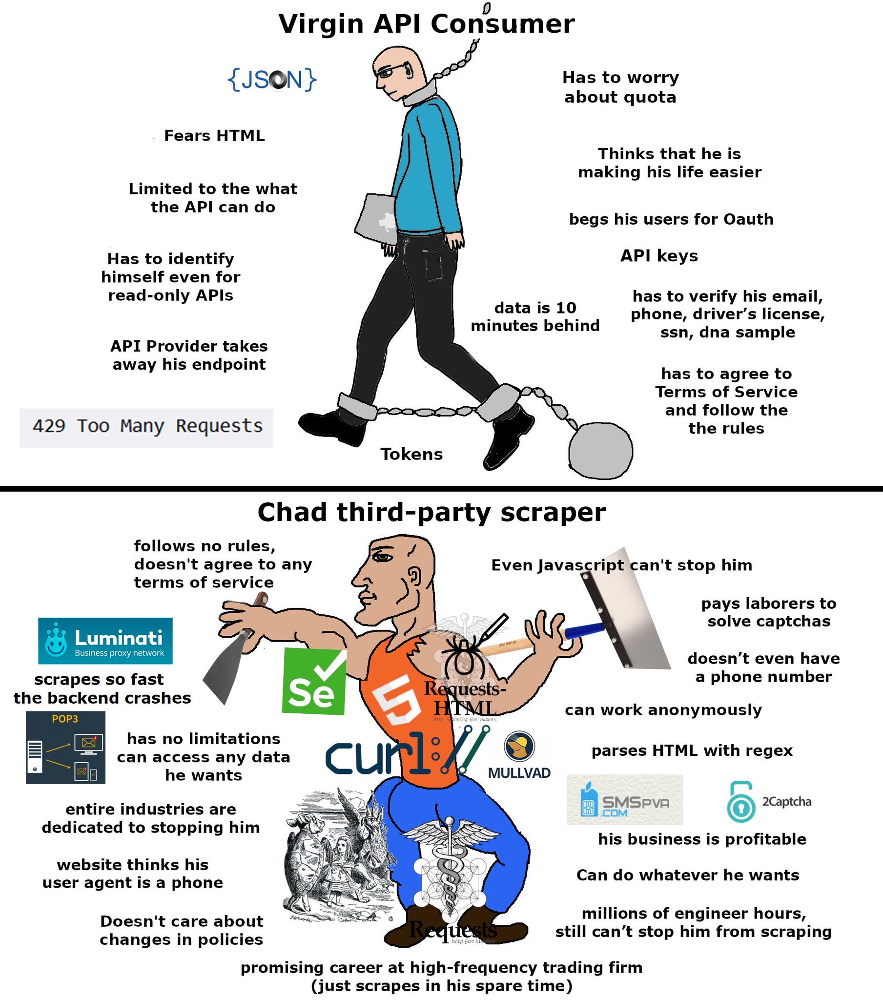

# Toybox

All toys listed here were **allegedly** tested under intense fire and abuse

Qualifications for listing:
- Services are anonymous unless specified otherwise
- Must be obscure/underground knowledge (No "reddit"/"awesome list" tier)
- The sketchier the purpose the better lol

 

# What's inside?

## Swiss knifes
- Payloads - https://gchq.github.io/CyberChef/
- DNS - https://dnsdumpster.com/

## Marketplaces
- Exploits - https://0day.today/
- Tor2Door. Physical goods, services - http://jtli3cvjuwk25vys2nveznl3spsuh5kqu2jcvgyy2easppfx5g54jmid.onion/

## Email verification bypasses
- One time use, random domain rotation - https://temp-mail.org/
- @gmail.com domain, one time use (for bypassing domain whitelist) - https://smailpro.com/
- Almost always in the domain whitelist + persistent (10-20s to create) - https://account.proton.me/signup

## Phone verification bypasses
- Many countries - https://sms-activation-service.com/
- 3 countries, cheap - http://sms-reg.com/

## Proxies
- Paid, medium volume - https://vn5socks.net/
- Paid, high volume - https://proxy.am/en/buy
- Paid, medium volume - https://papaproxy.net/panel/index.php?rp=/store/proxy
- Free, Tor rotating proxy (stable) https://hub.docker.com/r/mattes/rotating-proxy

## Other bypasses 
- Find real IP behind CloudFlare - https://github.com/zidansec/CloudPeler

## Other
- 010 Editor. Good for multi gigabyte text files and RE - https://rutracker.org/forum/viewtopic.php?t=6016911
- Non-KYC services - https://kycnot.me/
- Send SMS anonymously with bitcoin - https://sms4sats.com/
- Windows bind proxy to specific app - https://rutracker.org/forum/viewtopic.php?t=5363818
- Windows app isolation (including firewall and proxy binding) - https://sandboxie-plus.com/downloads/
- Windows application firewall - https://www.henrypp.org/product/simplewall